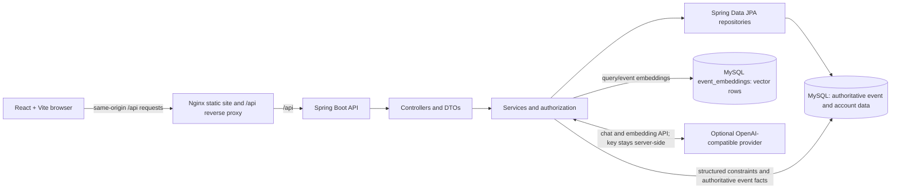

# HAPPENING architecture



## Runtime boundaries

- React contains role-aware page navigation and sends HTTP requests. It does not contain database credentials, JWT signing material, or the AI provider key.
- Nginx serves the production Vite build and proxies `/api/` to the backend service. This keeps browser requests same-origin in the Compose deployment.
- Spring Security validates bearer JWTs. Method/controller authorization and service-level ownership checks protect privileged actions; frontend guards are not a security boundary.
- Services enforce event moderation, ownership, transactional booking seat counts, cancellation, favorites, review eligibility, and grounded AI retrieval.
- MySQL is the source of truth for users, events, bookings, favorites, reviews, and event facts. Embeddings are auxiliary rows indexed after event transactions commit.
- Category/city caching is in-process. Embedding synchronization is best-effort asynchronous work; booking and inventory updates are synchronous and transactional.

## Compose request path

```text
Browser -> frontend:80 (Nginx) -> backend:8080 -> mysql:3306
```

The Compose network is private by default. Host ports for MySQL and the backend bind to loopback for development access; only the frontend port is intended for browser access. A public host should place a TLS reverse proxy in front and keep MySQL inaccessible from the Internet.
