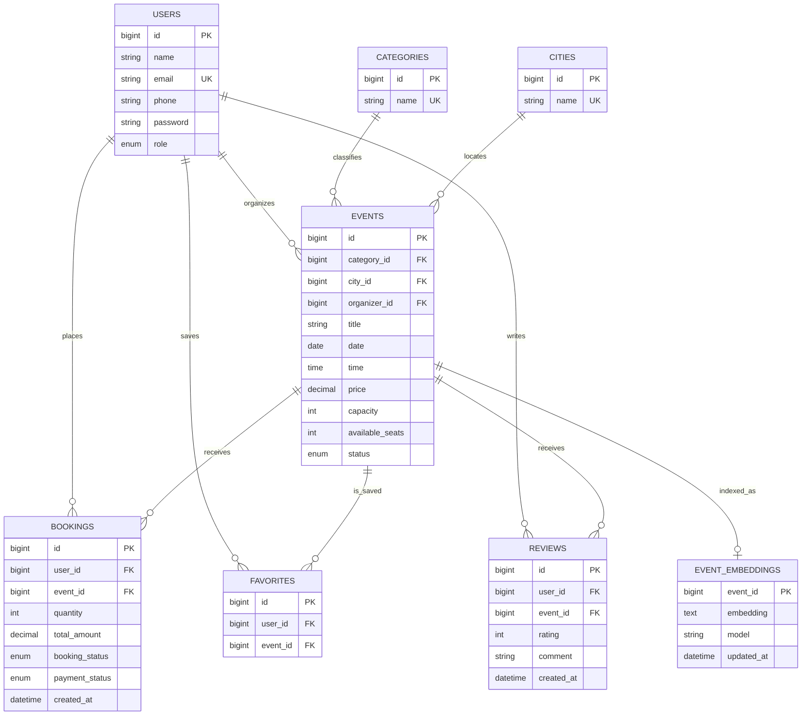

# HAPPENING ER diagram

`EVENTS.status` uses `PENDING`, `APPROVED`, `REJECTED`, or `CANCELLED`; public event reads are restricted to `APPROVED`. User roles are `USER`, `ORGANIZER`, and `ADMIN`. Booking statuses are `CONFIRMED` and `CANCELLED`; payment statuses are `PENDING`, `PAID`, `FAILED`, and `REFUNDED`. `EVENT_EMBEDDINGS.event_id` is the primary key but is not mapped as a database foreign key in the current entity. A unique user/event constraint prevents duplicate favorites and reviews. Confirm exact column types and constraints against the JPA entities when changing the schema.
