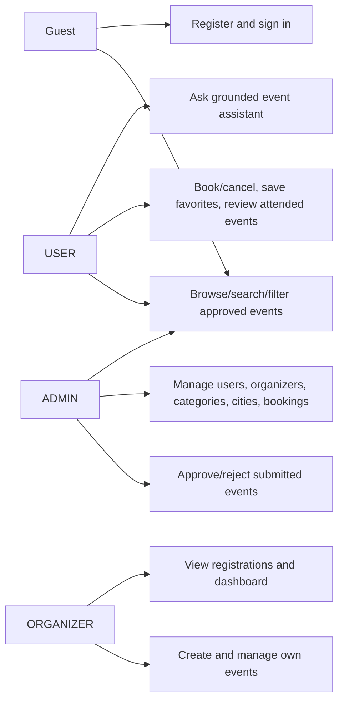

# HAPPENING use cases

Backend policy is authoritative: users can access only their own bookings, favorites, and reviews; organizers can manage only their events; event approval and administrative endpoints are ADMIN-only.
